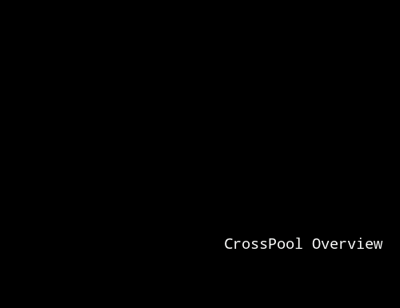
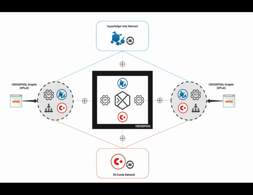
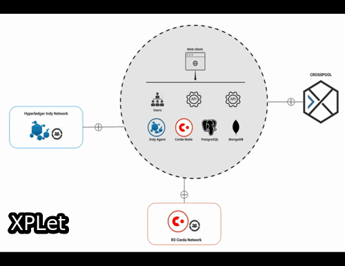

# CrossPool Overview

CrossPool is built based on two blockchain systems, the R3 [Corda](https://www.corda.net) and Hyperledger [Indy](https://www.hyperledger.org/projects/hyperledger-indy), composed of the CrossPool core services and multiple instances of the distributed "node" called CrossPool Droplet, a.k.a. _*XPLet*_.

# Transactions

Transactions of the Digital Asset-Backed Securities (DABS), a.k.a. asset tokens, take place between the XPLets across the Corda network. Transaction recipient's DID (decentralized identifier or digital ID) will be KYC verified against the Hyperledger Indy network by the CrossPool Indy Oracle service.

# XPLet

XPlet is a free available package consisting of

- front-end web client
- back-end server and APIs
- Hyperledger Indy SDK
- Corda node
- MongoDB (optional if you have an existing one of version 4.0+)
- PostgreSQL (optional if you have an existing one)

Any DABS *`issuer`* or service provider could be able to install, customise and run the XPLet to join the CrossPool ecosystem and issue asset tokens with minimal effort.

DABS *`investors`* are served by the XPLet and the user data are managed by the XPLet owner (i.e. the issuer) locally. CrossPool processes the transactions only using DIDs and their Indy Verifiable Credentials.
  

#### N.B.

- Further reading about Hyperledger Indy DID and Verifiable Credentials, please refer to [this](https://github.com/hyperledger/education/blob/master/LFS171x/docs/introduction-to-hyperledger-indy.md)
- CrossPool currently implements the Cordite [Distributed General Ledger](https://cordite.readthedocs.io/en/latest/content/concepts/dgl.html#dgl) as the Corda ledger for token issuance and account management