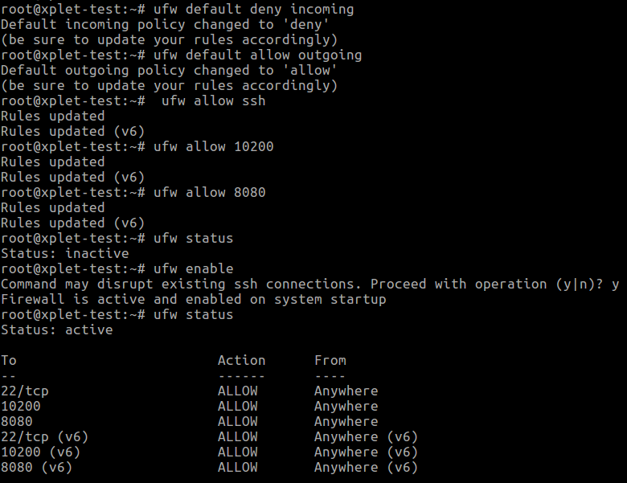
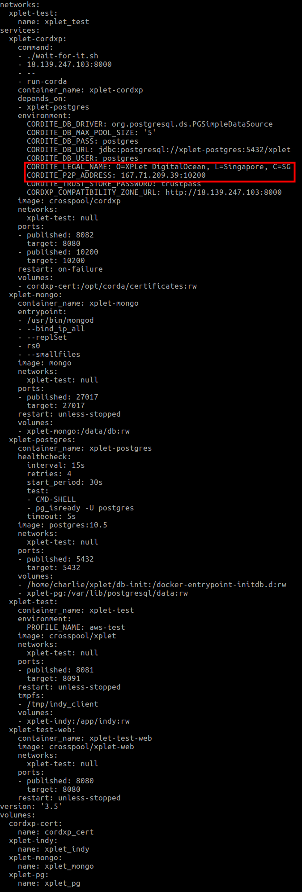
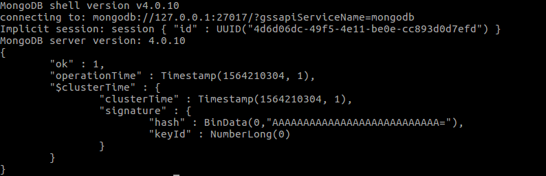
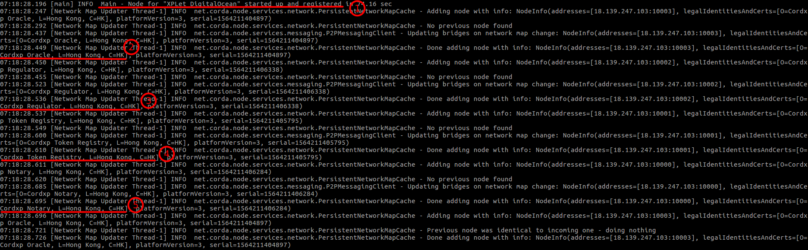
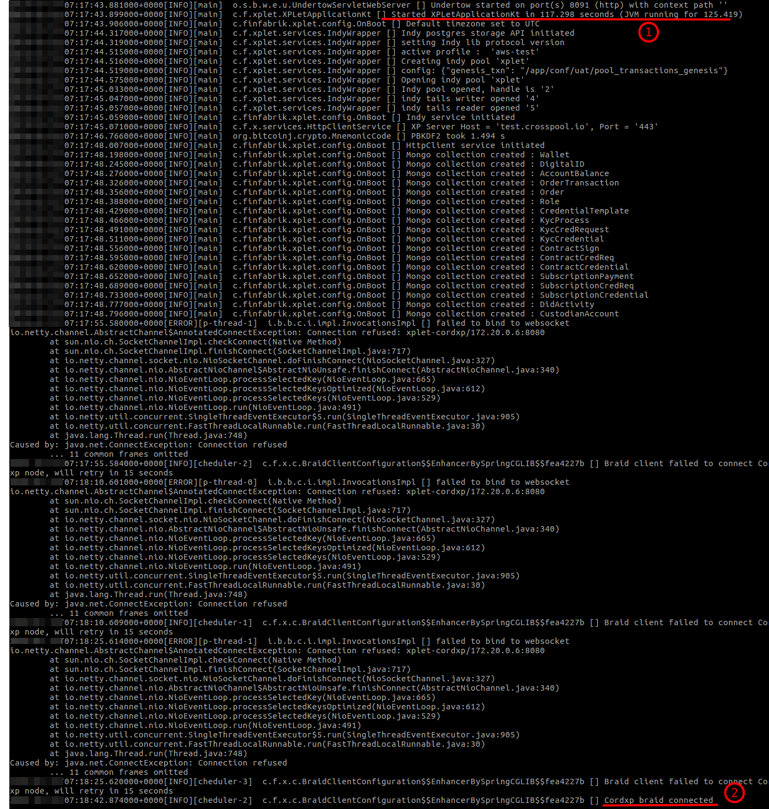
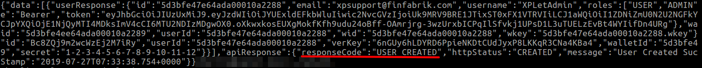
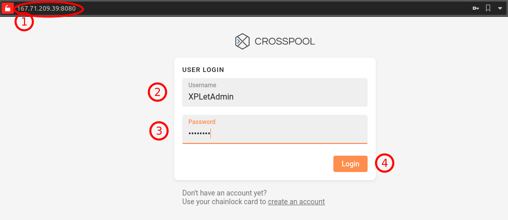

# XPLet Dockers

Prerequisite
---

- Public IP accessible server host
- Docker (17.12.0+)  and Docker Compose (1.19.0+)
- 2G free memory
- curl

Watch the demo
---

This [demo](http://youtu.be/jvP7S8MJHkw) shows you how to issue, allocate and claim DABS tokens using XPLet.

Server Setup
---

This setup example is based on an Ubuntu 18 DigitalOcean Droplet.

### Create a DigitalOcean Droplet

- Here we selected a 3G host located in Singapore
 


- After connected into the host as the **root** user, use the following instructions to

    - Setup host [manual](https://www.digitalocean.com/community/tutorials/initial-server-setup-with-ubuntu-18-04)
    - Install Docker [manual](https://www.digitalocean.com/community/tutorials/how-to-install-and-use-docker-on-ubuntu-18-04)
    - Install Docker Compose [manual](https://www.digitalocean.com/community/tutorials/how-to-install-docker-compose-on-ubuntu-18-04)

- Also we need to open up two extra ports, `10200` for the Corda node p2p access and `8080` for XPLet web access



### Setup and Start the XPLet dockers

SSH into the host using the **normal** user created in step 2's host setup, then

- clone this project and change to dockers folder
```bash
$ git clone git@github.com:finfabrik/xplet.git
$ cd xplet/dockers
```

- edit `env.conf` file and replace place holders with your environment values

| Place Holder | Remark |
| ------------ | ------ |
| `<company>` | Company or XPLet name |
| `<city>` | host location |
| `<country two letter code>` | host country |
| `<public IP address>` | host's public accessible IP address |

For example:
```text
export XPLET_NAME="O=XPLet DigitalOcean, L=Singapore, C=SG"
export XPLET_IP="167.71.209.39"
```

- execute the following commands to check the docker compose configuration

```bash
$ source env.conf
$ docker-compose -f docker-compose-xplet-aws-test.yml config
```

and you should see an output like this:


- if the config looks all right, execute the following command to pull and start the dockers

```bash
$ docker-compose -f docker-compose-xplet-aws-test.yml up -d
```

- since XPLet uses the new transactions feature of MongoDB 4.0, we need to initiate the MongoDB Replica Set. Wait for several seconds after the above step completed successfully and execute the following command

```bash
$ ./mongo-init-replicas.sh
``` 

and you should see an output like this:


- check if all dockers are up and running ok

```bash
$ docker ps --format 'table {{.Names}}\t{{.ID}}\t{{.CreatedAt}}\t{{.Status}}\t{{.Ports}}'
```

- check if the Corda node joined the CrossPool test network successfully

```bash
$ docker logs -f xplet-cordxp
```

After logs rolling stopped, you should see the node started up and registered (1), and the other nodes `Cordxp Oracle` (2), `Cordxp Regulator` (3), `Cordxp Token Registry` (4) and `Cordxp Notary` (5) were added:



type ctrl-c to quit watching logs

- check if the XPLet server started successfully and connected with the Corda node

```bash
$ docker logs xplet-test
```

you should see the server started (1) and connected with the Corda node (2):


### Create Admin User and Access the XPLet Web

- execute the following command to create an admin user in XPLet

```bash
$ ./register-admin
```

you should see a response of *USER_CREATED* from the XPLet server like this:


- go to http://`<public IP address>`:8080 (1) and login as `XPLetAdmin` (2) using `password` (3) as the password



### Testing

After logged in as the `XPLetAdmin` issuer, you can test the XPLet by issuing new tokens and allocating them to investors. Watch [this](http://youtu.be/jvP7S8MJHkw) demo video to see how. XPLetAdmin's secret is `1-2-3-4-5-6-7-8-9-10-11-12`.

Here are some DIDs you can use for testing the token allocation and claim:

DID | Secret |
--- |  ---   |
5vNHb2WAegygJByXa4fco8 | taste-bomb-upgrade-fitness-wash-decade-tuition-bullet-glory-purpose-relax-swift
WVYhBkqcEPEgthdBthWEDX | little-mistake-faint-chase-void-depend-dynamic-position-motion-tool-canal-already
BdZ4xJ4DB9PRjmhZJ4hp4G | choose-voyage-move-twice-radio-fix-economy-clinic-mule-glimpse-turkey-absent
NNdr5NQhJFYKdKbNPDvqzk | elegant-false-stove-bird-verb-before-depth-grass-business-resource-two-swear
hVRHgfVdPVc2wc1iwn29b |  ketchup-invite-much-movie-upgrade-beauty-pipe-brass-balcony-toast-glow-sphere

Use the following URL for investors to claim the allocated tokens: 

http://`<public IP address>`:8080/#/en/claim

If you want to test the mobile browser with QR code scanning, you need to setup Nginx and follow this [instruction](https://www.digitalocean.com/community/tutorials/how-to-create-a-self-signed-ssl-certificate-for-nginx-in-ubuntu-18-04) to enable HTTPS, then use HTTPS port as a proxy to port 8080.

**Please contact us (see below) for the token you issued, and someone from our support team will approve it for your testing.**

### Stop XPLet

- execute the following command to stop all dockers

```bash
$ docker-compose -f docker-compose-xplet-aws-test.yml down
```

- all databases are stored under docker volumes, execute the following command to clear the volumes and remove the data 

```bash
$ docker volume ls -qf dangling=true | xargs docker volume rm
```

Contact Info
---

- Follow us on twitter [@FFCrossPool](https://twitter.com/FFCrossPool)
- Join our gitter [XPLet community](https://gitter.im/XPLet/community)
- Send emails to [xpsupport@finfabrik.com](mailto:xpsupport@finfabrik.com)

WARNING
---

This version is for demo and testing only, please DO NOT use it in production environment.

We will reset the test network regularly without notice, and the blockchain ledgers will be emptied with data loss.