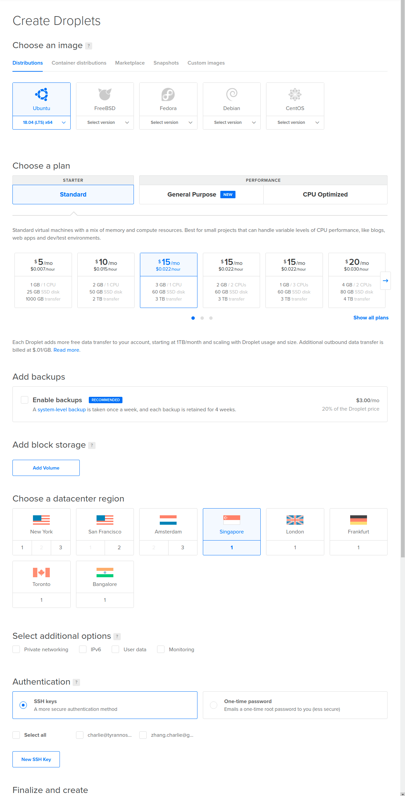
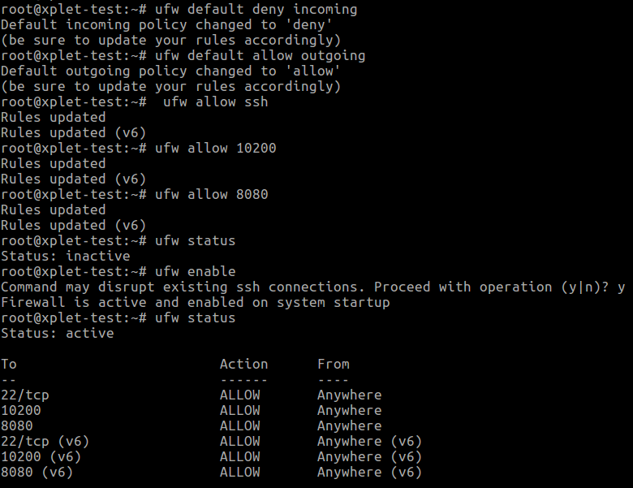
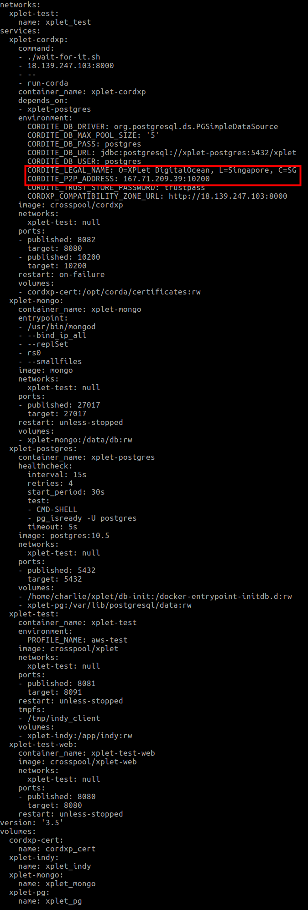
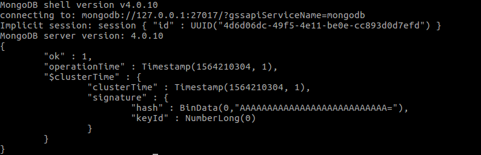
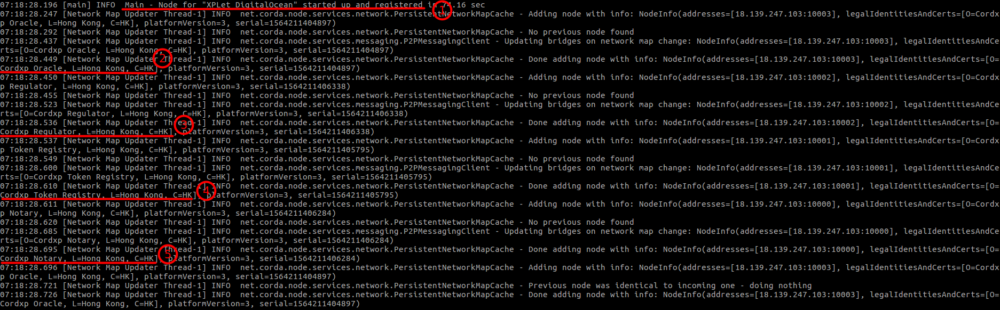

# XPLet Docker

Prerequisite
---

- Public IP accessible server host
- Docker (17.12.0+)  and Docker Compose (1.19.0+)
- 2G free memory

Server Setup
---

This example is based on a Ubuntu 18 DigitalOcean Droplet.

### Create a DigitalOcean Droplet

1. Here we selected a 3G host located in Singapore
 


2. After connected into the host as the **root** user, use the following instructions to

- Setup host [manual](https://www.digitalocean.com/community/tutorials/initial-server-setup-with-ubuntu-18-04)
- Install Docker [manual](https://www.digitalocean.com/community/tutorials/how-to-install-and-use-docker-on-ubuntu-18-04)
- Install Docker Compose [manual](https://www.digitalocean.com/community/tutorials/how-to-install-docker-compose-on-ubuntu-18-04)

3. Also we need to open up two extra ports, `10200` for the Corda node p2p access and `8080` for XPLet web access



4. SSH into the host using the **normal** user created in step 2's host setup, then

- clone this project and change to this folder
```bash
$ git clone git@github.com:finfabrik/xplet.git
$ cd xplet/dockers
```

- edit `env.conf` file and replace place holders with real values

| Place Holder | Remark |
| ------------ | ------ |
| `<company>` | Company or XPLet name |
| `<city>` | host location |
| `<country two letter code>` | host country |

For example:
```text
export XPLET_NAME="O=XPLet DigitalOcean, L=Singapore, C=SG"
export XPLET_IP="167.71.209.39"
```

- execute the following commands to check the docker compose configuration

```bash
$ source env.conf
$ docker-compose -f docker-compose-xplet-aws-test.yml config
```

and you should see an output like this:


- if the config looks all right, execute the following command to pull and start the dockers

```bash
$ docker-compose -f docker-compose-xplet-aws-test.yml up -d
```

- since XPLet uses the new transactions feature of MongoDB 4.0, we need to initiate the MongoDB Replica Set. Wait for several seconds after the above step completed successfully and execute the following command

```bash
$ ./mongo-init-replicas.sh
``` 

and you should see an output like this:


- check if all dockers are up and running ok

```bash
$ docker ps --format 'table {{.Names}}\t{{.ID}}\t{{.CreatedAt}}\t{{.Status}}\t{{.Ports}}'
```

- check if the Corda node joined the CrossPool test network successfully

```bash
$ docker logs xplet-cordxp
```

you should see the node started up and registered (1), and the other nodes `Cordxp Oracle` (2), `Cordxp Regulator` (3), `Cordxp Token Registry` (4) and `Cordxp Notary` (5) were added:



- check if the XPLet server started successfully and connected with the Corda node

```bash
$ docker logs xplett-test
```

you should see the server started (1) and connected with the Corda node (2):
